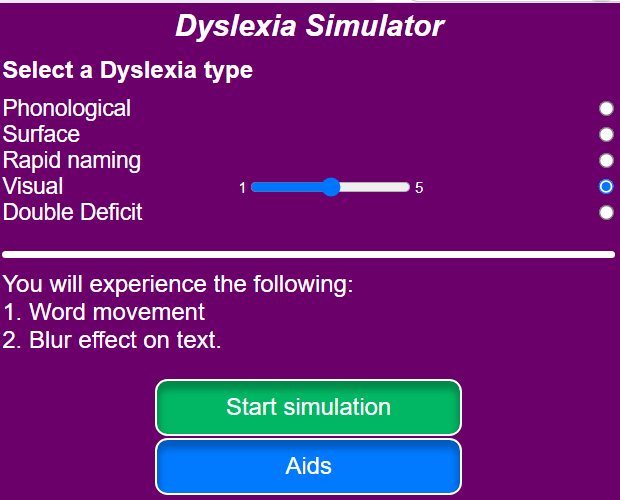
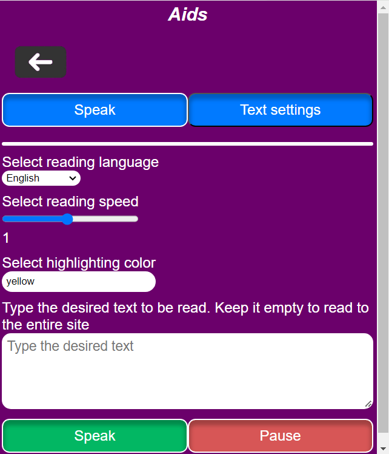
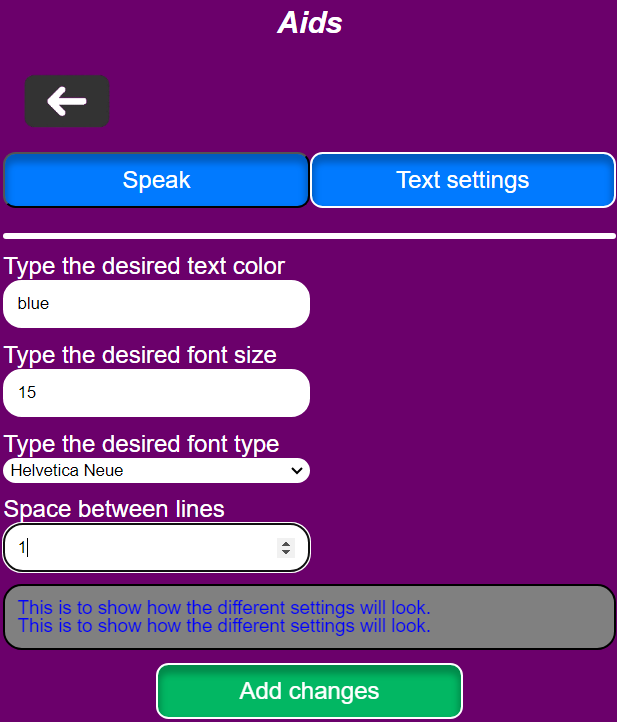

# Dyslexia-Simulator

  

    
  

 
## Table of Contents

- [Introduction](#introduction)
- [Tools and Frameworks](#tools-and-frameworks)

## Introduction

This project is going to show, what it feels like being dyslexic by creating a simulation extension in Chrome. The idea of the project is provided by the company "Vitec MV".

## Tools and frameworks

### Implemntation

- HTML
- CSS
- JavaScipt
- React.js

### Unit testing

- Jest
- jsdom
